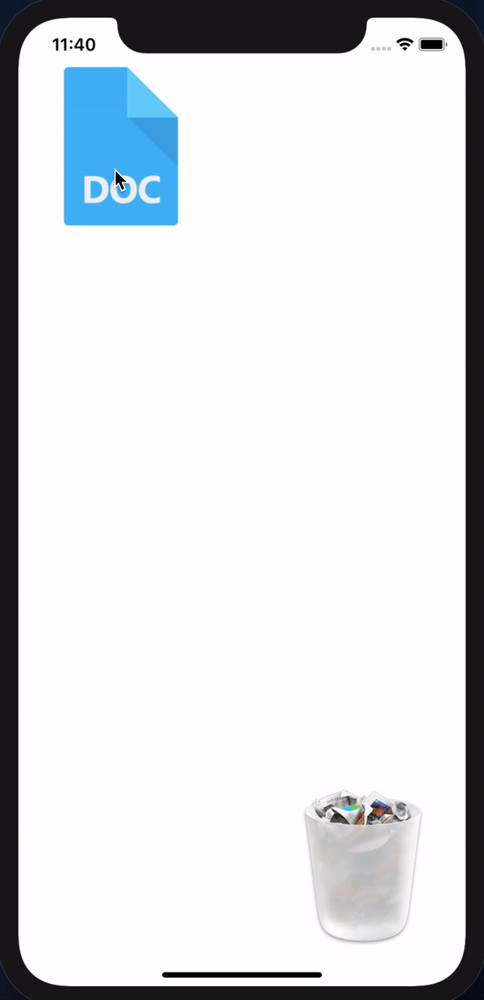

# Gesture-Recogniser-Practice
Basic app to implement gesture recogniser and see how they operate

## Steps:

* Added two image views to a storyboard using auto layout, allowed for user interaction on the imageViews. 
* Created add pan gesture function
* Created handle pan fucntion using a switch statement to compare UI translation states Begin/Change/Ended 
* Used logic to check if file image CGRect (Frame) intersects with the trash CGRect (Frame) then file dissapears otherwise file image moves back to origin

## Key Learning

* CGRect frame intersection
* UIPanGesture logic and state management Beginning/Change/Ended using a switch statement
